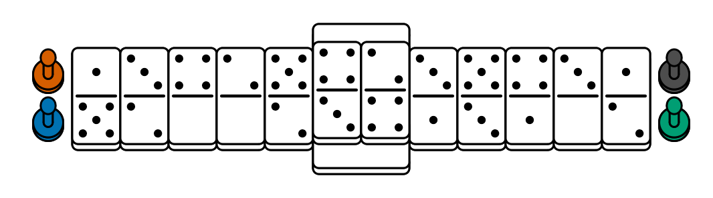
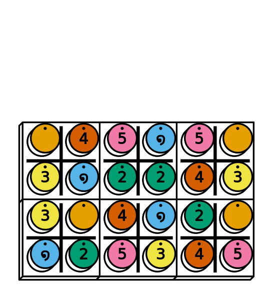

# ppdf

[](https://cran.r-project.org/package=ppdf)
[](https://github.com/piecepackr/ppdf/actions)
[](https://app.codecov.io/github/piecepackr/ppdf)
[](https://www.repostatus.org/#wip)

## Table of Contents

* [Overview](#overview)
* [Installation](#installation)
* [Examples](#examples)

  + [Domino Fuji-san](#fujisan)
  + [Lines of Action](#loa)
  + [Piecepack Tablut](#tablut)
  + [Using PPN to animate a game of Relativity](#relativity)

* [Supported games](#supported)

  + [Checkers Sets](#checkers)
  + [Chess Sets](#chess)
  + [Dominoes](#dominoes)
  + [Piecepacks](#piecepack)

* [External links](#links)

  + [R packages](#software)
  + [Boardgame rules](#rules)

## <a name="overview">Overview</a>

* This package contains *functions* that return `{tibble}` data frames with (possibly random) setup data for over a hundred board games playable with public domain game systems.  
* This board game data can be visualized by [{piecepackr}](https://www.github.com/piecepackr/piecepackr) using the `{grid}`, `{ggplot2}`, `{rayrender}`, `{rayvertex}`, or `{rgl}` graphics systems or in a command-line interface by `ppcli::cat_piece()` (optionally) using `{crayon}`.
* If you use [Portable Piecepack Notation (PPN)](https://trevorldavis.com/piecepackr/portable-piecepack-notation.html) to record the moves for any of games supported by this package then you can visualize any/all of the moves for that game with the help of the PPN parser in [{ppgames}](https://www.github.com/piecepackr/ppgames) (**NB. PPN support for most recently added games is TODO**).  
* The package name "ppdf" is an acronym for **p**iece**p**ackr **d**ata **f**rames".  
* Many of these functions were originally contained (under a slightly different name) in the experimental [{ppgames}](https://www.github.com/piecepackr/ppgames) and [{tradgames}](https://www.github.com/piecepackr/tradgames) packages.

## <a name="installation">Installation</a>

```{r install, eval = FALSE}
remotes::install_github("piecepackr/ppdf")
```

## <a name="examples">Examples</a>

### <a name="fujisan">Domino Fuji-san</a>

```{r grid-fuji-san}
df_fujisan <- ppdf::dominoes_fujisan(seed = 42)

if (requireNamespace("piecepackr", quietly = TRUE) &&
    requireNamespace("systemfonts", quietly = TRUE) &&
    all(capabilities("png"))) {
  library("piecepackr")
  envir <- game_systems(pawn = "joystick", round = TRUE)
  render_piece(df_fujisan, file = "man/figures/README-fujisan.png",
               envir = envir, op_scale = 0.5, op_angle = 90,
               trans = op_transform, as_top = "pawn_face")
}
```



### <a name="loa">Lines of Action</a>

```{r grid-lines-of-action}
df_loa <- ppdf::checkers_lines_of_action()

if (requireNamespace("piecepackr", quietly = TRUE) &&
    requireNamespace("systemfonts", quietly = TRUE) &&
    all(capabilities("png"))) {
  library("piecepackr")
  envir <- game_systems()
  render_piece(df_loa, file = "man/figures/README-lines-of-action.png",
               envir = envir, op_scale = 0.5, trans = op_transform)
}
```


### <a name="tablut">Piecepack Tablut</a>

```{r grid-tablut}
df_tablut <- ppdf::piecepack_tablut()

if (requireNamespace("piecepackr", quietly = TRUE) &&
    requireNamespace("systemfonts", quietly = TRUE) &&
    piecepackr::has_font("Dejavu Sans") &&
    all(capabilities(c("cairo", "png")))) {
  library("piecepackr")
  envir <- game_systems("dejavu", pawn = "joystick")
  render_piece(df_tablut, file = "man/figures/README-tablut.png",
               envir = envir, op_scale = 0.5,
               trans = op_transform, as_top = "pawn_face")
}
```


### <a name="relativity">Using PPN to animate a game of Relativity</a>

An example game of [Relativity](https://trevorldavis.com/piecepackr/relativity.html) recorded in the [Portable Piecepack Notation (PPN)](https://trevorldavis.com/piecepackr/portable-piecepack-notation.html#relativity) format:

```{r relativity-file, eval=requireNamespace("ppgames", quietly = TRUE), results = 'asis'}
ppn_file <- system.file("ppn/relativity.ppn", package = "ppgames")
cat(paste("\t", readLines(ppn_file)), sep = "\n")
```

```{r should-run-animation, echo=FALSE, results='hide'}
should_run_animation <- requireNamespace("gifski", quietly = TRUE) &&
    requireNamespace("piecepackr", quietly = TRUE) &&
    requireNamespace("ppgames", quietly = TRUE) &&
    requireNamespace("tweenr", quietly = TRUE) &&
    requireNamespace("systemfonts", quietly = TRUE) &&
    piecepackr::has_font("Dejavu Sans")
```

Since *Relativity* is one of the games supported by this package (i.e. the function `piecepack_relativity()`) then `ppgames::read_ppn()` can be used to parse this PPN file and then `ppgames::animate_game()` can be used to animate the parsed game:

```{r relativity, eval=should_run_animation, message=FALSE}
library("gifski")
library("piecepackr")
library("ppgames") # remotes::install_github("piecepackr/ppgames")
library("tweenr")

envir <- game_systems("dejavu")
cfg <- as.list(envir$piecepack)
cfg$suit_color <- "black"
cfg$background_color.r1 <- "#E69F00"
cfg$background_color.r2 <- "#56B4E9"
cfg$background_color.r3 <- "#009E73"
cfg$background_color.r4 <- "#F0E442"
cfg$background_color.r5 <- "#D55E00"
cfg$background_color.r6 <- "#F079A7"
envir$piecepack <- pp_cfg(cfg)

ppn_file <- system.file("ppn/relativity.ppn", package = "ppgames")
game <- read_ppn(ppn_file)[[1]]
animate_game(game, file = "man/figures/README-relativity.gif",
              annotate = FALSE,
              envir = envir, trans = op_transform, op_scale = 0.5,
              n_transitions = 3, n_pauses = 2, fps = 7)
```



## <a name="supported">Supported games</a>

### <a name="checkers">Checkers Sets</a>

`{ppdf}` supports the following `r nrow(ppdf::games_checkers())` games playable with a (possibly non-8x8) checkers set:

`r ppdf:::readme_markdown_list(ppdf::games_checkers())`

### <a name="chess">Chess Sets</a>

`{ppdf}` supports the following `r nrow(ppdf::games_chess())` games playable with a (possibly non-8x8) chess set:

`r ppdf:::readme_markdown_list(ppdf::games_chess())`

### <a name="dominoes">Dominoes</a>

`{ppdf}` supports the following `r nrow(ppdf::games_dominoes())` games playable with a (usually double-6) dominoes set (plus possibly additional components):

`r ppdf:::readme_markdown_list(ppdf::games_dominoes())`

### <a name="piecepack">Piecepacks</a>

`{ppdf}` supports the following `r nrow(ppdf::games_piecepack())` games playable with a piecepack deck (plus possibly additional components):

`r ppdf:::readme_markdown_list(ppdf::games_piecepack())`

## <a name="links">External links</a>

### <a name="software">R packages</a>

* [{piecepackr}](https://www.github.com/piecepackr/piecepackr) can be used visualize game setups generated by `{ppdf}` with `{grid}`, `{ggplot2}`, `{rayrender}`, `{rayvertex}`, or `{rgl}` graphics systems.
* [{ppgames}](https://www.github.com/piecepackr/ppgames) contains a [Portable Piecepack Notation (PPN)](https://trevorldavis.com/piecepackr/portable-piecepack-notation.html) parser that handles all the games supported by this package (and more)
* [{piecenikr}](https://www.github.com/piecepackr/piecenikr) has Looney Pyramids aka Icehouse pieces support.
* [splendid-r-games](https://github.com/matt-dray/splendid-r-games) for list of games you can play in the R language

### <a name="rules">Boardgame rules</a>

* [BoardGameGeek](https://boardgamegeek.com/)
* [Cyningstan](http://www.cyningstan.com/)
* [The Chess Variant Pages](https://www.chessvariants.com/)
* [Donimoes](http://donkirkby.github.io/donimoes/rules.html)
* [Pagat](https://www.pagat.com/)
* [The Piecepack Wiki](https://ludism.org/ppwiki/HomePage)
* [Wikipedia](https://en.wikipedia.org/)
* [The World of Abstract Games](http://www.di.fc.ul.pt/~jpn/gv/)
