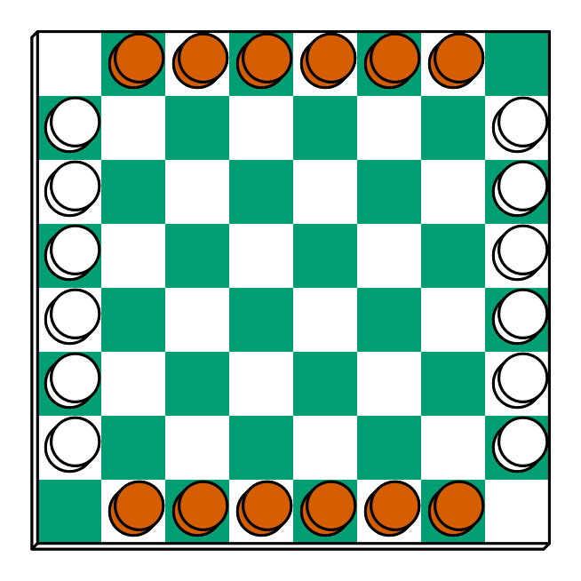
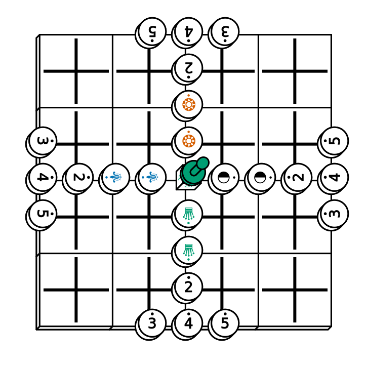

# ppdf

[](https://cran.r-project.org/package=ppdf)
[](https://github.com/piecepackr/ppdf/actions)
[](https://app.codecov.io/github/piecepackr/ppdf)
[](https://www.repostatus.org/#wip)

## Table of Contents

* [Overview](#overview)
* [Installation](#installation)
* [Examples](#examples)

  + [Domino Fuji-san](#fujisan)
  + [Lines of Action](#loa)
  + [Piecepack Tablut](#tablut)
  + [Using PPN to animate a game of Relativity](#relativity)

* [Supported games](#supported)

  + [Checkers Sets](#checkers)
  + [Chess Sets](#chess)
  + [Dominoes](#dominoes)
  + [Piecepacks](#piecepack)
  + [Other games](#other)

* [External links](#links)

  + [R packages](#software)
  + [Boardgame rules](#rules)

## <a name="overview">Overview</a>

* This package contains *functions* that return `{tibble}` data frames with (possibly random) setup data for over a hundred board games playable with public domain game systems.
* This board game data can be visualized by [{piecepackr}](https://github.com/piecepackr/piecepackr) using the `{grid}`, `{ggplot2}`, `{rayrender}`, `{rayvertex}`, or `{rgl}` graphics systems or in a command-line interface using `{cli}` by `ppcli::cat_piece()`.
* If you use [Portable Piecepack Notation (PPN)](https://trevorldavis.com/piecepackr/portable-piecepack-notation.html) to record the moves for any of games supported by this package then you can visualize any/all of the moves for that game with the help of the PPN parser in [{ppn}](https://github.com/piecepackr/ppn).
* The package name "ppdf" is an acronym for **p**iece**p**ackr **d**ata **f**rames".
* Many of these functions were originally contained (under a slightly different name) in the experimental [{ppgames}](https://github.com/piecepackr/ppgames) and [{tradgames}](https://github.com/piecepackr/tradgames) packages.

## <a name="installation">Installation</a>


``` r
remotes::install_github("piecepackr/ppdf")
```

## <a name="examples">Examples</a>

### <a name="fujisan">Domino Fuji-san</a>


``` r
df_fujisan <- ppdf::domino_fujisan(seed = 42)

if (requireNamespace("piecepackr", quietly = TRUE) &&
    all(capabilities("png"))) {
  library("piecepackr")
  envir <- game_systems(pawn = "joystick", round = TRUE)
  render_piece(df_fujisan, file = "man/figures/README-fujisan.png",
               envir = envir, op_scale = 0.5, op_angle = 90,
               trans = op_transform, as_top = "pawn_face")
}
```


### <a name="loa">Lines of Action</a>


``` r
df_loa <- ppdf::checkers_lines_of_action()

if (requireNamespace("piecepackr", quietly = TRUE) &&
    all(capabilities("png"))) {
  library("piecepackr")
  envir <- game_systems()
  render_piece(df_loa, file = "man/figures/README-lines-of-action.png",
               envir = envir, op_scale = 0.5, trans = op_transform)
}
```



### <a name="tablut">Piecepack Tablut</a>


``` r
df_tablut <- ppdf::piecepack_tablut()

if (requireNamespace("piecepackr", quietly = TRUE) &&
    requireNamespace("systemfonts", quietly = TRUE) &&
    piecepackr::has_font("Dejavu Sans") &&
    all(capabilities(c("cairo", "png")))) {
  library("piecepackr")
  envir <- game_systems("dejavu", pawn = "joystick")
  render_piece(df_tablut, file = "man/figures/README-tablut.png",
               envir = envir, op_scale = 0.5,
               trans = op_transform, as_top = "pawn_face")
}
```



### <a name="relativity">Using PPN to animate a game of Relativity</a>

An example game of [Relativity](https://trevorldavis.com/piecepackr/relativity.html) recorded in the [Portable Piecepack Notation (PPN)](https://trevorldavis.com/piecepackr/portable-piecepack-notation.html#relativity) format:


``` r
ppn_file <- system.file("ppn/relativity.ppn", package = "ppn")
cat(paste("\t", readLines(ppn_file)), sep = "\n")
```

	 ---
	 Round: Night
	 GameType: 
	     Name: Relativity
	     Coins: "n45a5n/3a2243/3n4a2n/a25345"
	 ...
	 { Notes: Space has power of adjacency while Time has power of sequence }
	 1S. d3#e3 1T. d3#d1
	 2S. c2#c3 2T. d2#b1;M2@e6
	 3S. b2#a2 3T. e3#b2
	 4S. f1#f4 4T. e2#a3;M3@e6
	 5S. c4#d4 5T. f1#a1
	 6S. c1#c4;M5@b6 6T. b3#a3
	 7S. f3#a3 7T. d1#a3
	 8S. f2#f3 8T. b1#d2
	 9S. f3#a3;Mn@b6 9T. e2#c2
	 10S. e1#f1 10T. f1#d4
	 11S. c2#c3 11T. d4#c4
	 12S. b2#c2 12T. c1#e2;Ma@e6
	 


Since *Relativity* is one of the games supported by this package (i.e. the function `piecepack_relativity()`) then `ppn::read_ppn()` can be used to parse this PPN file and then `ppn::animate_game()` can be used to animate the parsed game:


``` r
library("gifski")
library("piecepackr")
library("ppn") # remotes::install_github("piecepackr/ppn")
library("tweenr")

envir <- game_systems("dejavu")
cfg <- as.list(envir$piecepack)
cfg$suit_color <- "black"
cfg$background_color.r1 <- "#E69F00"
cfg$background_color.r2 <- "#56B4E9"
cfg$background_color.r3 <- "#009E73"
cfg$background_color.r4 <- "#F0E442"
cfg$background_color.r5 <- "#D55E00"
cfg$background_color.r6 <- "#F079A7"
envir$piecepack <- pp_cfg(cfg)

ppn_file <- system.file("ppn/relativity.ppn", package = "ppn")
game <- read_ppn(ppn_file)[[1]]
animate_game(game, file = "man/figures/README-relativity.gif",
              annotate = FALSE,
              envir = envir, trans = op_transform, op_scale = 0.5,
              n_transitions = 3, n_pauses = 2, fps = 7)
```


## <a name="supported">Supported games</a>

### <a name="checkers">Checkers Sets</a>

`{ppdf}` supports the following 24 games playable with a (possibly non-8x8) checkers set:

* [(American) Checkers AKA (English) Draughts](https://en.wikipedia.org/wiki/Draughts)
* [American Pool Checkers](https://draughts.github.io/american-pool-checkers.html)
* [Brazilian Checkers AKA Brazilian Draughts](https://en.wikipedia.org/wiki/Brazilian_draughts)
* [Breakthrough](https://en.wikipedia.org/wiki/Breakthrough_(board_game))
* [Canadian Checkers AKA Canadian Draughts](https://en.wikipedia.org/wiki/Canadian_checkers)
* [Crossings](https://en.wikipedia.org/wiki/Crossings_(game))
* [Czech Checkers AKA Czech Draughts](https://en.wikipedia.org/wiki/Czech_draughts)
* [Dameo](https://en.wikipedia.org/wiki/Dameo)
* [Dao](https://boardgamegeek.com/boardgame/948/dao)
* [Focus](https://en.wikipedia.org/wiki/Focus_(board_game))
* [Four Field Kono](https://en.wikipedia.org/wiki/Four_Field_Kono)
* [Frisian Checkers AKA Frisian Draughts](https://en.wikipedia.org/wiki/Frisian_draughts)
* [Gothic Checkers AKA Gothic Draughts](http://mlwi.magix.net/bg/gothiccheckersvariants.htm)
* [Grasshopper](http://www.cyningstan.com/game/71/grasshopper)
* [International Checkers AKA International Draughts](https://en.wikipedia.org/wiki/International_draughts)
* [Italian Checkers AKA Italian Draughts](https://en.wikipedia.org/wiki/Italian_draughts)
* [Jamaican Checkers AKA Jamaican Draughts](https://web.archive.org/web/20230605023244/http://poolcheckers.com/jamaica/)
* [Jul-Gonu](https://en.wikipedia.org/wiki/Jul-Gonu)
* [Lines of Action](https://en.wikipedia.org/wiki/Lines_of_Action)
* [Portuguese Checkers AKA Portuguese Draughts](http://www.fpdamas.pt/regras/)
* [Russian Checkers AKA Russian Draughts](https://en.wikipedia.org/wiki/Russian_draughts)
* [Spanish Checkers AKA Spanish Draughts](https://mindsports.nl/index.php/on-the-evolution-of-draughts-variants/draughts-variants/497-dama_s)
* [Thai Checkers AKA Thai Draughts AKA Mak-hot AKA Makhos](https://checkers.fandom.com/wiki/Mak-hot)
* [Turkish Checkers AKA Turkish Draughts AKA Dama](https://en.wikipedia.org/wiki/Turkish_draughts)

### <a name="chess">Chess Sets</a>

`{ppdf}` supports the following 5 games playable with a (possibly non-8x8) chess set:

* [Fischer Random Chess AKA Chess960](https://www.chessvariants.com/diffsetup.dir/fischer.html)
* [Horde Chess](https://lichess.org/variant/horde)
* [(International) Chess](https://en.wikipedia.org/wiki/Chess)
* [Monochrome Chess](https://wunderland.com/WTS/Andy/Games/monochess.html)
* [Racing Kings](https://www.chessvariants.com/diffobjective.dir/racing.html)

### <a name="dominoes">Dominoes</a>

`{ppdf}` supports the following 7 games playable with a (usually double-6) dominoes set (plus possibly additional components):

* [Concentration](http://www.domino-play.com/Games/Concentration.htm)
* [Domino Finder](https://donkirkby.github.io/donimoes/rules.html#domino-finder)
* [(Domino) Fuji-san](http://donkirkby.github.io/donimoes/rules.html#fujisan)
* [(Domino) Patience](http://www.domino-play.com/Games/Patience.htm)
* [Domino Runners](https://donkirkby.github.io/donimoes/rules.html#domino-runners)
* [Luzon](http://www.domino-play.com/Games/Luzon.htm)
* [The Jubilee](http://www.domino-play.com/Games/Jubilee.htm)

### <a name="piecepack">Piecepacks</a>

`{ppdf}` supports the following 96 games playable with a piecepack deck (plus possibly additional components):

* [12345ive!](https://boardgamegeek.com/boardgame/154644/12345ive)
* [Alice Chess](https://en.wikipedia.org/wiki/Alice_chess)
* [Alien City](https://www.ludism.org/ppwiki/AlienCity)
* [Alquerque AKA Qirkat](https://en.wikipedia.org/wiki/Alquerque)
* [(American) Checkers AKA (English) Draughts](https://www.ludism.org/ppwiki/Checkers)
* [American Pool Checkers](https://draughts.github.io/american-pool-checkers.html)
* [Awithlaknannai Mosona](https://en.wikipedia.org/wiki/Awithlaknannai_Mosona)
* [Backgammon](https://www.ludism.org/ppwiki/Backgammon)
* [Bagh-chal](https://www.ludism.org/ppwiki/Bagh_Chal)
* [Black Pawn Trucking](https://www.ludism.org/ppwiki/BlackPawnTrucking)
* [Brain Burn](https://www.ludism.org/ppwiki/BrainBurn)
* [Brandubh AKA Brandub](http://www.cyningstan.com/game/125/brandub)
* [Brazilian Checkers AKA Brazilian Draughts](https://en.wikipedia.org/wiki/Brazilian_draughts)
* [Breakthrough](https://en.wikipedia.org/wiki/Breakthrough_(board_game))
* [Burbuja](https://www.ludism.org/ppwiki/Burbuja)
* [Cardinal's Guards](https://ludism.org/ppwiki/CardinalsGuards)
* [Cell Management](https://www.ludism.org/ppwiki/CellManagement)
* [Change Change](https://www.ludism.org/ppwiki/ChangeChange)
* [Chariots](https://www.ludism.org/ppwiki/Chariots)
* [Chaturaji](https://www.ludism.org/ppwiki/Chaturaji)
* [Chinese Checkers AKA (Piecepack) Halma](https://www.ludism.org/ppwiki/ChineseCheckers)
* [Climbing Man](https://www.ludism.org/ppwiki/ClimbingMan)
* [Coin Collectors](https://www.ludism.org/ppwiki/CoinCollectors)
* [Cribbage](https://www.ludism.org/ppwiki/Cribbage)
* [Crocodile Hop](https://www.ludism.org/ppwiki/CrocodileHop)
* [Crossings](https://en.wikipedia.org/wiki/Crossings_(game))
* [Czech Checkers AKA Czech Draughts](https://en.wikipedia.org/wiki/Czech_draughts)
* [Dao](https://boardgamegeek.com/boardgame/948/dao)
* [Desfases](https://www.ludism.org/ppwiki/Desfases)
* [Dominoids](https://ludism.org/ppwiki/Dominoids)
* [Easy Slider](https://www.ludism.org/ppwiki/EasySlider)
* [Evade](https://www.ludism.org/ppwiki/Evade)
* [Everest](https://www.ludism.org/ppwiki/Everest)
* [Fischer Random Chess AKA Chess960](https://www.chessvariants.com/diffsetup.dir/fischer.html)
* [Four Blind Mice](https://www.ludism.org/ppwiki/FourBlindMice)
* [Four Field Kono](https://www.ludism.org/ppwiki/FourFieldKono)
* [Four Seasons Chess](https://www.chessvariants.com/historic.dir/4seiz.html)
* [Froggy Bottom](https://www.ludism.org/ppwiki/FroggyBottom)
* [Fuji-san](https://www.ludism.org/ppwiki/Fuji-san)
* [Galaxy Express](https://www.ludism.org/ppwiki/GalaxyExpress)
* [Gothic Checkers AKA Gothic Draughts](http://mlwi.magix.net/bg/gothiccheckersvariants.htm)
* [Grasshopper](http://www.cyningstan.com/game/71/grasshopper)
* [Ice Floe](https://www.ludism.org/ppwiki/IceFloe)
* [Iceberg](https://www.ludism.org/ppwiki/Iceberg)
* [(International) Chess](https://www.ludism.org/ppwiki/Chess)
* [Italian Checkers AKA Italian Draughts](https://en.wikipedia.org/wiki/Italian_draughts)
* [Jamaican Checkers AKA Jamaican Draughts](https://web.archive.org/web/20230605023244/http://poolcheckers.com/jamaica/)
* [Japan](https://www.ludism.org/ppwiki/Japan)
* [Jul-Gonu](https://www.ludism.org/ppwiki/JulGonu)
* [Lab Rats](https://www.ludism.org/ppwiki/LabRats)
* [Landlocked](https://www.ludism.org/ppwiki/Landlocked)
* [Ley Lines](https://www.ludism.org/ppwiki/LeyLines)
* [Lines of Action](https://en.wikipedia.org/wiki/Lines_of_Action)
* [Ludo](https://en.wikipedia.org/wiki/Ludo_(board_game))
* [Lukawan](https://ludism.org/ppwiki/Lukawan)
* [Mathrix](https://www.ludism.org/ppwiki/Mathrix)
* [Minishogi](https://en.wikipedia.org/wiki/Minishogi)
* [Nine Men's Morris](https://en.wikipedia.org/wiki/Nine_men%27s_morris)
* [One Man Thrag!](https://www.ludism.org/ppwiki/OneManThrag)
* [Pass the Food](https://www.ludism.org/ppwiki/PassTheFood)
* [Pawns Crossing](https://ludism.org/ppwiki/PawnsCrossing)
* [Piece Gaps](https://www.ludism.org/ppwiki/PieceGaps)
* [Piece Packing Pirates](https://www.ludism.org/ppwiki/PiecePackingPirates)
* [(Piecepack) Klondike](https://ludism.org/ppwiki/PiecepackKlondike)
* [Piecepackman](https://www.ludism.org/ppwiki/Piecepackman)
* [Plans of Action](https://www.ludism.org/ppwiki/PlansOfAction)
* [Portuguese Checkers AKA Portuguese Draughts](http://www.fpdamas.pt/regras/)
* [Quatri](https://www.ludism.org/ppwiki/Quatri)
* [Racing Kings](https://www.chessvariants.com/diffobjective.dir/racing.html)
* [Relativity](https://www.ludism.org/ppwiki/Relativity)
* [Russian Checkers AKA Russian Draughts](https://en.wikipedia.org/wiki/Russian_draughts)
* [Salta](https://en.wikipedia.org/wiki/Salta_(game))
* [San Andreas](https://www.ludism.org/ppwiki/SanAndreas)
* [Sarcophagus](https://www.ludism.org/ppwiki/Sarcophagus)
* [Ship It!](https://ludism.org/ppwiki/Ship_It)
* [Shogi AKA Japanese Chess](https://www.ludism.org/ppwiki/Shogi)
* [Shopping Mall](https://www.ludism.org/ppwiki/ShoppingMall)
* [Skyscrapers](https://www.ludism.org/ppwiki/Skyscrapers)
* [Slides of Action](https://www.ludism.org/ppwiki/SlidesOfAction)
* [Spanish Checkers AKA Spanish Draughts](https://mindsports.nl/index.php/on-the-evolution-of-draughts-variants/draughts-variants/497-dama_s)
* [Speedy Towers](https://ludism.org/ppwiki/SpeedyTowers)
* [Steppin' Stones](https://ludism.org/ppwiki/Steppin'_Stones)
* [Tablut](https://www.ludism.org/ppwiki/Tablut)
* [Thai Checkers AKA Thai Draughts AKA Mak-hot AKA Makhos](https://checkers.fandom.com/wiki/Mak-hot)
* [The "In" Crowd](https://www.ludism.org/ppwiki/TheInCrowd)
* [The Magic Bag](https://www.ludism.org/ppwiki/The_Magic_Bag)
* [The Penguin Game](https://www.ludism.org/ppwiki/PenguinGame)
* [Tower of Babel AKA (Piecepack) Accordion](https://www.ludism.org/ppwiki/TowerOfBabel)
* [Tracers](https://www.ludism.org/ppwiki/Tracers)
* [Triactor](https://www.ludism.org/ppwiki/Triactor)
* [Tula](https://www.ludism.org/ppwiki/Tula)
* [Turkish Checkers AKA Turkish Draughts AKA Dama](https://en.wikipedia.org/wiki/Turkish_draughts)
* [Twelve Men's Morris](https://en.wikipedia.org/wiki/Morabaraba)
* [Ultima AKA Baroque Chess](https://en.wikipedia.org/wiki/Baroque_chess)
* [Wormholes](https://www.ludism.org/ppwiki/Wormholes)
* [Xiangqi AKA Chinese Chess](https://www.ludism.org/ppwiki/Xiangqi)

### <a name="other">Other games</a>

`{ppdf}` supports the following 2 games playable with an alquerque set

* [Alquerque](https://en.wikipedia.org/wiki/Alquerque)
* [Bagh-chal](https://en.wikipedia.org/wiki/Bagh-chal)


## <a name="links">External links</a>

### <a name="software">R packages</a>

* [{piecepackr}](https://github.com/piecepackr/piecepackr) can be used visualize game setups generated by `{ppdf}` with `{grid}`, `{ggplot2}`, `{rayrender}`, `{rayvertex}`, or `{rgl}` graphics systems.
* [{ppcli}](https://github.com/piecepackr/ppcli) can be used to visualize game setups generated by `{ppdf}` in the terminal with `{cli}`.
* [{ppn}](https://github.com/piecepackr/ppn) contains a [Portable Piecepack Notation (PPN)](https://trevorldavis.com/piecepackr/portable-piecepack-notation.html) parser that handles all the games supported by this package (and more)
* [{piecenikr}](https://github.com/piecepackr/piecenikr) has Looney Pyramids aka Icehouse pieces support.
* [splendid-r-games](https://github.com/matt-dray/splendid-r-games) for list of games you can play in the R language

### <a name="rules">Boardgame rules</a>

* [BoardGameGeek](https://boardgamegeek.com/)
* [Cyningstan](http://www.cyningstan.com/)
* [The Chess Variant Pages](https://www.chessvariants.com/)
* [Donimoes](http://donkirkby.github.io/donimoes/rules.html)
* [Pagat](https://www.pagat.com/)
* [The Piecepack Wiki](https://ludism.org/ppwiki/HomePage)
* [Wikipedia](https://en.wikipedia.org/wiki/Main_Page)
* [The World of Abstract Games](https://jpneto.github.io/world_abstract_games/)
